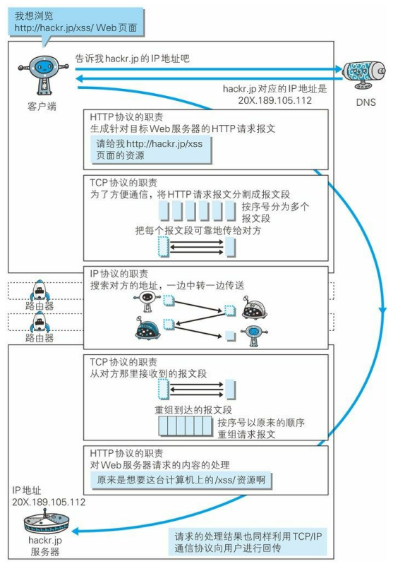

# 图解HTTP

 #笔者阅读《图解HTTP》所获所感，以此记录

## 第一章：了解Web及网络基础

##### 1.1 http在传输中的介绍

HTTP(Hyper Text Transfer Protocol)超文本传输协议 

总流程概述：

客户端在浏览器地址栏输入URL ，浏览器进行DNS地址解析得到iIP，并附加HTTP报文其余信息，通过路由、交换机发往服务器，服务器处理响应，根据请求报文发送响应报文，后由客户端浏览器解析HTML文档返回用户界面

##### 1.2 网络基础 TCP/IP 

注：有关TCP/IP可阅读《图解TCP/IP》

TCP/IP协议族，通信双方建立通信协议，采用相同格式相同要求传输接收报文

分层网络：应用层		 FTP(File Transfer Protocol)文件传输协议 DNS(Domain Name System)域名系统 HTTP协议

​				   传输层   	  TCP （Transmission Control Protocol) 传输控制协议   UDP (User Data Protocol)用户数据报协议

​				   网络层		路由算法，IP(Internet Protocol)网际协议

​				   链路层		硬件设备 网络适配器（网卡），光纤

##### 1.3 与HTTP关系密切的协议 ：IP TCP DNS

IP:每一个被分配到的IP地址与MAC（media access control address)地址配对，MAC为计算机网卡固定地址不变，IP可变

 

路由协议：

DNS域名解析：

主机名+域名

					ip地址

获取网页相同

##### 1.4 URL/URI

URL(uniform resource locator)统一资源定位符 如：浏览器访问web的网址

URI(uniform resource identifier)  适用范围更广，除web还包括ftp mailto telnet file 等资源

URI的格式

## 第二章：简单的HTTP协议

##### 2.1 HTTP是不保存状态的协议

HTTP协议自身不对请求和相应之间的通信状态进行保存，协议对于发送过的请求或相应都不做持久化处理（为了减少服务器CPU和资源消耗，更快处理业务）

但有时需要用户在页面跳转时保持登录状态，于是引入了cookie技术，实现了状态管理

  

cookie技术使得服务器只需要生成cookie并记录对应的发送方，以少量的内存资源负担解决了HTTP无状态的问题，

可与F12中某一条记录中查看右侧信息得到cookie     

##### 2.2 告知服务器意图的HTTP方法：

GET:获取资源

POST：传输实体主体，通常会携带信息，如用户名密码，也要求获取资源

PUT：传输文件，一般只有特定的网站使用该方法

HEAD:获得报文头部

DELETE：删除文件

OPTIONS：询问支持的方法

TRACE:追踪路径	CONNECT:要求用隧道协议连接代理(HTTPS中使用SSL、TLS交换密钥，认证，从而建立安全连接)

登录B站搜索某一关键词，打开F12后刷新页面，可在网络中查看到浏览器与服务器之间的GET POST OPTIONS请求

##### 2.3 持久连接节省通信量

早期HTTP版本中，每一次HTTP通信就要建立然后断开TCP连接

有关TCP的三次握手 四次挥手：

三次握手为建立连接时，用于确认客户端和服务器双方的接收信息能力与发送信息能力正常

第一次握手，客户端向服务器发送信息，请求建立连接

第二次握手，当服务器收到客户端的请求报文，证明客户端具有发送信息能力，并向客户端发送响应报文

第三次握手，当客户端接收到服务器的响应报文，证明客户端由发送信息的能力，接收信息能力，服务器有发送信息能力，并向服务器发送一次确认信息

这时双方都确认双方都具有收发信息的能力，可以建立通信

（如果是需要建立安全连接，三次握手中的信息还需包含密钥以及需验证的密码）

四次挥手为断开连接时，用于结束双方通信连接，需要双方都同意并确认断开连接

（通信双方都可申请主动断开连接，这里以服务器为例）

第一次挥手，服务器向客户端申请断开连接

第二次挥手，客户端告知服务器已知服务器要和他断开连接

第三次挥手，客户端告知服务器将要与服务器断开连接

第四次挥手，服务器告知客户端已知客户端要和服务器断开连接，等待一小段时间后若没有任何信息回应则断开连接

早期通信都是容量较小的文本传输，每次请求造成无谓的TCP连接建立与断开，增加通信量的开销。

为解决该问题，HTTP/1.1提出建立持久连接，只要任意一端没有明确提出断开连接则保持TCP连接状态，如今默认连接都是持久连接，如下图keep-alive

## 第三章：HTTP报文内的HTTP信息	+	第六章：HTTP首部

HTTP报文分为请求报文和响应报文，报文结构如下，其中报文首段分为通用首部字段（请求+响应都有）、请求首部字段，响应首部字段、实体首部字段

报文结构：

​	

##### 1.1 通用首部字段

##### 1.2 请求首部字段

以该请求报文为例  				

调用GET 方法，使用HTTP/2协议

向主机地址HOST为www.bilibili.com的服务器发送请求

发送方的部分信息USER-AGENT 通常由浏览器提供，包含浏览器属性及电脑系统属性，如火狐，windows x86 64位

可接受报文的种类及权重ACCEPT ，表示可以接受HTML/XML/IAMGE等文件，q代表期望返回文件的权重，默认q=1.0

可接受报文的语言种类及权重ACCEPT-language:如 zh-CN中文 en-US英文

（若访问的服务器不提供改报文类型或语言则按权重依次返回）

实体部分压缩方式 ACCEPT ENCODING

连接方式（默认）：持久连接（keep-alive)

登录网站需要的认证信息：cookie

##### 1.3 响应首部字段

##### 1.4 实体首部字段

以该响应报文为例										

了解即可~

## 第四章：返回结果的HTTP状态码

状态码告知从服务器端返回的结果

状态码的类别：

下面介绍几种常见的状态码，仅做科普：

##### 200 OK 表示请求成功

##### 204 No content 请求成功，没有实体报文

##### 206 Partial content  表示请求报文只请求了部分网页信息，且返回成功

##### 301 Move permanently

##### 302 Found （不建议使用）

301与302类似，301代表原URL失效，已永久转移到另一个新的URL；302代表原URL目前失效，暂时转移到一个新的URL

如果你已经将该URL存为一个书签，则301会自动更新你的书签保存的值并跳转到新URL，302则不会更新书签，会暂时跳转到新的URL处

##### 400 Bad request HTTP报文有语法错误

##### 401 Unauthorized 页面需要认证信息，常见与需要登陆的网站，浏览器初次接收到401相应会弹出认证用的对话窗口

##### 403 Forbidden 

##### 404 Not found 

403暗示了所请求的资源确实存在。跟401一样，若服务器不想透露此信息，它可以谎报一个404

##### 418 I‘m a tea pot 表示服务器察觉到使用爬虫进行访问

当客户端给一个茶壶发送泡咖啡的请求时，茶壶就返回一个418错误状态码，表示“我是一个茶壶”

##### 500 Internal Server error 服务器本身发生错误

##### 503 service unavailable 服务器处于超负荷或正在停机维护

## 第五章：与HTTP协作得Web服务器

##### 5.1用单台虚拟主机实现多个域名

即使物理层面只有一台服务器，只要使用虚拟主机的功能，即可以假想已具有多台服务器

域名通过DNS解析之后会映射到IP地址，当请求发送到服务器时，已经是IP地址得访问了，但如果一台服务器托管了多个域名，收到请求时就需要弄清楚到底要访问哪个域名，因此阿紫发送HTTP请求时必须再Host首部内完整指出主机名或域名得URL

##### 5.2 通信数据转发程序：代理、网关、隧道

##### 代理：具有转发功能的应用程序，扮演了位于服务器和客户端的中间人的角色

客户端发送请求到代理服务器，代理不改变URL直接发送给持有资源的目标服务器

持有资源实体的源服务器将资源发送给代理服务器，再传给客户端

每次通过代理服务器进行转发请求或响应的时候都会把代理服务器的地址写入via首部信息

代理有两种基准分类的使用方法：一种是否使用缓存，一种是否会修改报文

缓存代理(caching proxy)会预先将资源的副本保存再代理服务器上，当代理再次接收对相同资源的请求时，在确认资源有效性后，就可以不从源服务器获取资源，而是直接将缓存过的资源作为响应返回

若缓存过期，则重新更新缓存

换而言之，如果一份资源接收缓存代理，只要同一局域网内有一次下载成功，那么同一局域网内的其余人也可以很快拿到该资源

除了代理服务器可以缓存，客户端如浏览器也可以缓存资源

##### 网关：使通信线路上的服务器提供非HTTP协议服务

网关实质上是一个网络通向其他网络的IP地址。

比如有网络A和网络B，网络A的IP地址范围为“192.168.1.1~192. 168.1.254”，子网掩码为255.255.255.0；

网络B的IP地址范围为“192.168.2.1~192.168.2.254”，子网掩码为255.255.255.0。

在没有路由器的情况下，两个网络之间是不能进行TCP/IP通信的，即使是两个网络连接在同一台交换机（或集线器）上，TCP/IP协议也会根据子网掩码（255.255.255.0）与主机的IP 地址作 “与” 运算的结果不同判定两个网络中的主机处在不同的网络里。

而要实现这两个网络之间的通信，则必须通过网关。如果网络A中的主机发现数据包的目的主机不在本地网络中，就把数据包转发给它自己的网关，再由网关转发给网络B的网关，网络B的网关再转发给网络B的某个主机。网络A向网络B转发数据包的过程。

##### 隧道：按要求建立与其他服务器的通信线路，使用SSL等加密手段进行通信，确保安全通信

## 第七章：确保web安全的HTTPS

HTTP有不足之处：

通信使用明文(不加密)，内容可能会被窃听

不验证通信方的身份，因此有可能遭遇伪装

无法证明报文的完整性，所以有可能已被篡改

解决方法：1.通信的加密：HTTP没有加密机制，可以通过SSL(secure socket layer)安全套接层，TLS(transport layer security)安全传输层协议来进行加密

​				   2.内容的加密：要求客户端和服务器同时具备加密解密机制，对报文内容进行加密

问题：在HTTP协议通信时，任何人都可以发起请求，服务器只要接收到请求，不管对方是谁都会返回一个响应

不确认通信方，会造成以下隐患：

解决方法：查明对手的证书

证书由受信任的第三方机构颁发，用以证明服务器和客户端是实际存在的。伪造证书从技术角度来说是一件异常困难的事

客户端持有证书即可完成个人身份的确认，可用于web网站的认证环节

问题：无法证明报文完整性，可能以遭篡改

没有任何办法确认，发出的请求、响应和接收到的请求响应是前后相同的

解决方法：

MD5 、SHA-1散列值校验

MD5是一个单向陷门函数，可以理解若已知x  f，易得y=f(x)，但已知y  f，很难逆向求出x

SHA(Secure Hash Algorithm )该系列都为加密算法，其中介绍比较有名的SHA-256，该方法被广泛用于浏览器加密以及比特币得区块链加密中

在HTTP基础上加密就变成了HTTPS，通常在web登陆界面和购物结算界面等使用HTTPS通信

可以通过如下方式查看某一HTTPS网站的证书，或加密方式

 

公钥信息：

##### 公开密钥加密技术（建议选修密码学课程）

加密解密通用一个密钥的方式称为共享密钥加密，也叫做对称密钥加密，如凯撒密码：加密方式，所有字母顺次循环向后+3，a->d,b->e，abc->def,解密方式对称相反

以共享密钥方式加密需要把密钥也发送给对方，但通信被监听密钥也会落入攻击者之手，也就失去了加密意义，同时还需保管密钥，存在诸多问题

公开密钥加密则很好的解决了该问题

公开密钥使用非对称密钥，一把叫做私有密钥，一把公开密钥，私有密钥保密，公开密钥可随意发布

常见非对称RSA,AES,DES

一方根据另一方的公开密钥加密，将加密后的密文传输发送，接收方通过私有密钥解密

想要根据密文和公开密钥直接回复明文是很困难的，解密过程是在对离散对数进行求值，以目前算力很难迅速破解

简洁介绍其中一种，RSA加密方法，以帮助读者理解

RSA是第一个也是使用的最广泛的公钥加密算法，在1978年由R.Rivest、AdiShamir和Adleman三人发明，并以他们的名字命名。RSA算法的安全性基于大数因子分解的困难性

1.首先随机选择两个大素数*p*和*q*，计算*n = pq*

2.然后随机选择加密密钥*b*，满足*b*与(*p*-1)(*q*-1)互素。用扩展的Euclid算法计算解密密钥*a*，使得*ab* ==1 *mod* (*p*-1)(*q*-1) 即(a*b)%((p-1)(q-1))=1,求a

3.公开密钥：*b*和*n*

   秘密密钥：*a*

   加密：*y = x* ^*b* *mod n*

   解密：*x = y* ^*a* *mod n*

如 p=7,q=11,n=77,(p-1)*(q-1)=60,取b=13,求得a=37,即(13x37)%60=1

令x=10, 加密：*y = x* ^*b* *mod n*,则y=40,密文为40发送

解密：*x = y* ^*a* *mod n*,
